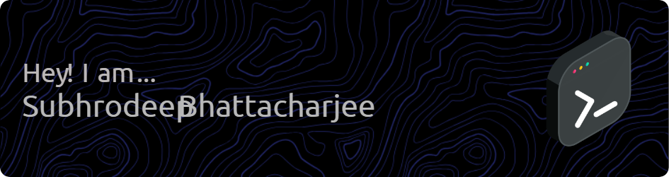

# 💫 About Me:
I am a BCA second year student. I am actively working on new projects. 

## 🌐 Socials:
   

# 💻 Tech Stack:

 
# 📊 GitHub Stats:

 

## 🏆 GitHub Trophies

### ✍️ Random Dev Quote

### 🔝 Top Contributed Repo

---

<!-- Proudly created with GPRM ( https://gprm.itsvg.in ) -->
